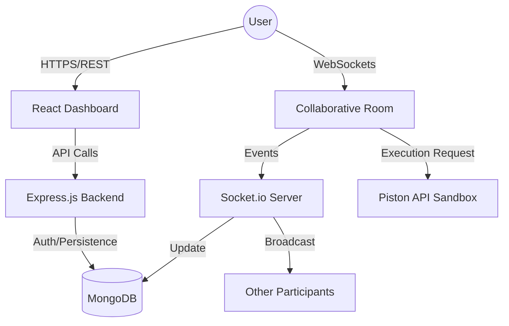
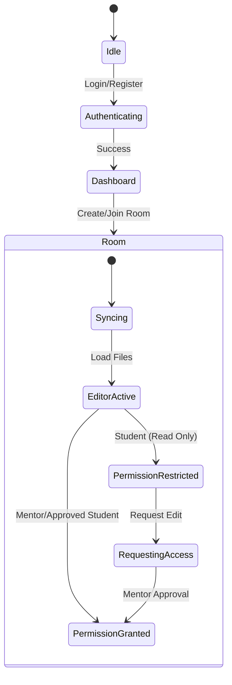
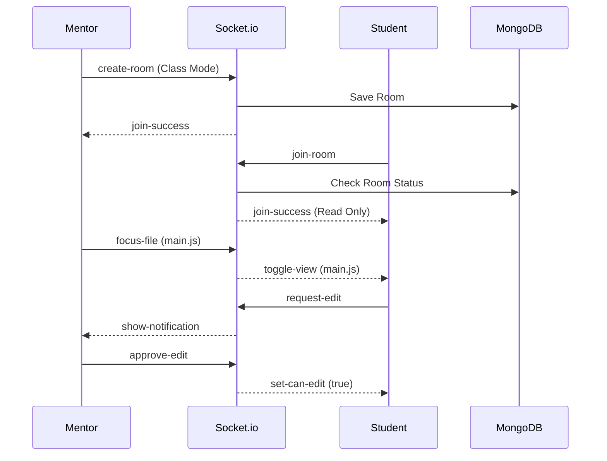

# CodeRoom: Real-Time Collaborative Mentoring Platform

CodeRoom is a full-stack, real-time collaborative code editor designed specifically for code mentoring and classroom environments. It enables mentors to guide students through real-time code execution, synchronized terminal sessions, and interactive feedback loops.

## 🚀 Core Objectives & Goals Completed

- **Real-Time Collaboration**: Implemented seamless multi-user code editing with operational transformation principles via Socket.io.
- **Mentor-Student Dynamic**: Built a specialized permission system where mentors control edit access, focus the class on specific files, and provide real-time "Advice" and "Annotations".
- **Execution Sandbox**: Integrated a terminal capable of executing code in 20+ languages with full support for standard input (stdin).
- **Session Persistence**: Automated history tracking for rooms and participants to allow review of past mentoring sessions.
- **Cross-User Synchronization**: Solved critical synchronization bugs related to file creation, cursor tracking, and state management across disparate clients.

## 🏗️ Architectural Overview

The project follows a **MERN-Socket** architecture (MongoDB, Express, React, Node.js + Socket.io) to balance data persistence with low-latency communication.

### Data Flow Diagram

### State Management Diagram

## 🧩 Project Modules

### 1. Authentication & User Management
Handles secure JWT-based authentication, user profiles, and session management.
- **Core Files**: `backend/src/routes/auth.js`, `frontend/src/context/UserContext.jsx`

### 2. Room Engine
The core of the application that manages "Rooms" (Class vs One-to-One modes). It handles session metadata, participant limits, and room status.
- **Core Files**: `backend/src/models/Room.js`, `backend/src/routes/rooms.js`

### 3. Collaborative Editor (Monaco)
Integrated VS Code's editor engine (Monaco) to provide features like IntelliSense, syntax highlighting, and multi-cursor support.
- **Core Files**: `frontend/src/components/CodeEditor.jsx`, `frontend/src/components/Cursor.jsx`

### 4. Real-Time Synchronization (Socket.io)
Managed the high-frequency event bus for code changes, cursor movements, and UI state syncing.
- **Core Files**: `backend/src/socketHandlers.js`, `frontend/src/services/socket.js`

### 5. Mentor Control Panel
A specialized UI for teachers to give advice, review code (annotations), and manage student permissions.
- **Core Files**: `frontend/src/components/MentorPanel.jsx`, `frontend/src/context/RoomContext.jsx`

### 6. Execution Sandbox (Terminal)
Connects the frontend terminal to the Piston API to run code and provide instant feedback.
- **Core Files**: `backend/src/routes/execute.js`, `frontend/src/components/VSCodeTerminal.jsx`

## 🛠️ Technical Stack & Implementation Approach

### Frontend
- **Framework**: React 19 (Vite)
- **Styling**: Tailwind CSS (Dark-themed IDE aesthetic)
- **Editor**: Monaco Editor (`@monaco-editor/react`)
- **State**: React Context API (UserContext, RoomContext) for global state management.

### Backend
- **Runtime**: Node.js (ES Modules)
- **Server**: Express.js
- **Database**: MongoDB (Mongoose)
- **Real-time**: Socket.io 4.x
- **Sandbox**: Piston API for isolated code execution.

## 💡 Key Learnings & Project Evolution
During development, we approached the project by prioritizing the **Mentor's UX**. We realized that simple collaborative editing wasn't enough for teaching; we needed "Control Features" like **File Focusing** (forcing all students to look at the same file) and **Access Toggles** (preventing students from breaking code during a demo). We optimized the socket layer to use room-based broadcasting to ensure scalability for larger classes (up to 50 users).

## 📊 UML Diagram: Room Interaction

---
*Documentation generated for CodeRoom Project - 2025*
# minor_project
